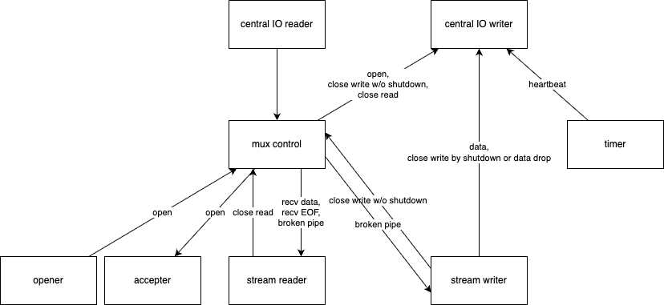

# `mux`

not on crates.io.

## Transport boundary

The separation between mux and RTP is intentional: it contains the complexity of both protocols. Mux should depend on the common reliable-stream contract and should be able to use TCP or RTP without changing its stream or session state machines. RTP-specific setup and exceptional behavior belong below the mux transport boundary. If replacing RTP with TCP requires redesigning mux behavior, treat that as a broken abstraction boundary.

## Architecture

## Throughput

- TCP: $1$
- this: $0.61$
- [`async_smux`](https://github.com/black-binary/async-smux): $0.58$
